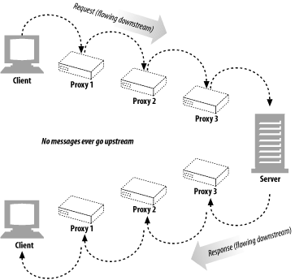
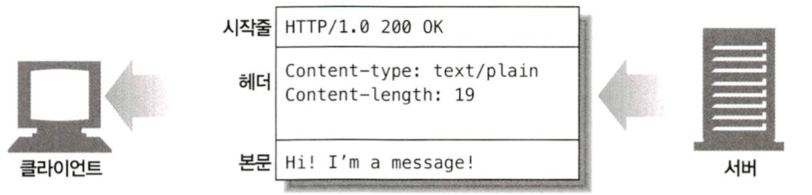
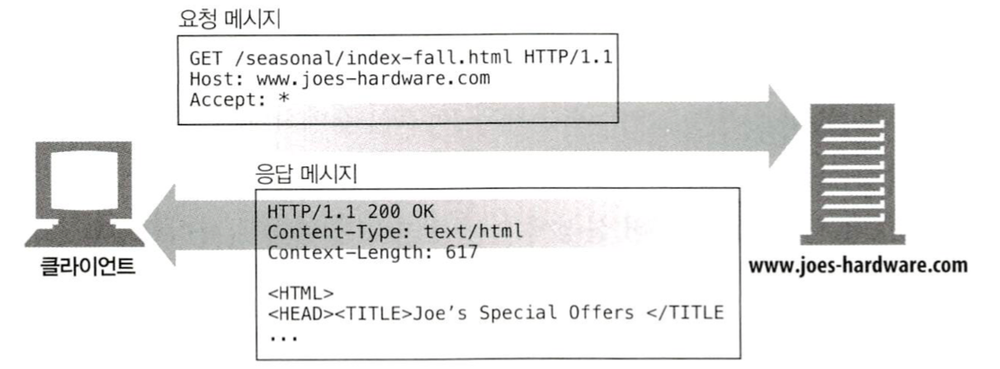
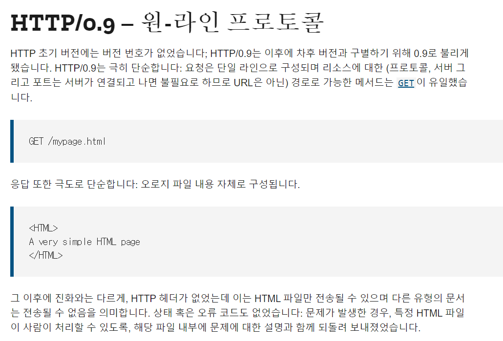

# 3. HTTP 메시지

- HTTP를 인터넷의 배달원이라 비유한다면, HTTP 메시지는 무언가를 담는 소포 또는 박스라고 말할 수 있다.

## 3.1 메시지의 흐름

- HTTP 메시지는 HTTP 애플리케이션 간에 주고받은 데이터의 블록이다.
- 이 데이터의 블록들은 메시지의 내용과 의미를 설명하는 텍스트 메타 정보로 시작하고 다음에 선택적으로 데이터가 올 수 있다.

### 3.1.1 메시지는 원 서버 방향을 인바운드로 하여 송신된다

- HTTP는 트랜잭션 방향을 표현하기 위해 인바운드와 아웃바운드라는 용어를 사용한다.
- 인바운드 : 메시지가 원 서버로 향하는 것
- 아웃바운드 : 모든 처리가 끝난 뒤, 메시지가 사용자 에이전트로 돌아오는 것

### 3.1.2 다운스트림으로 흐르는 메시지

- HTTP 메시지는 요청 메시지, 응답 메시지에 관계없이 모든 메시지는 다운스트림으로 흐른다. 



## 3.2 메시지의 각 부분

- HTTP 메시지는 단순한 데이터의 구조화된 블록이다.
- 각 메시지는 클라이언트의 요청이나 서버로부터의 응답 중 하나를 포함한다.
- 메시지는 시작줄, 헤더 블록, 본문 세 부분으로 이루어진다.
  - 시작줄 : 어떤 메시지인지 서술
  - 헤더 블록 : 속성
  - 본문 : 데이터(없을 수도 있음)
- **시작줄과 헤더**는 줄 단위로 분리된 아스키 문자열이다. 
- 각 줄은 캐리지 리턴(ASCII 13)과 개행 문자(ASCII 10)로 구성된 두 글자의 줄바꿈 문자열(CRLF)로 끝난다.
- **본문**은 단순히 선택적인 데이터 덩어리. 텍스트나 이진 데이터를 포함할 수도 비어있을 수도 있다.




### 3.2.1 메시지 문법

- 모든 HTTP 메시지는 요청 메시지 또는 응답메시지다. 

- 요청 메시지는 웹 서버에 어떠한 동작을 요구한다.

- 응답 메시지는 요청의 결과를 클라이언트에게 반환한다.

  


- 요청 메시지 형식
```
[메서드] [요청 URL] [HTTP 버전]  
[헤더]  

[본문]  
 
GET /specials/saw-blade.gif HTTP/1.0  
Host: www.joes-hardware.com

```

- 응답 메시지 형식

```
[HTTP 버전] [상태 코드] [사유 구절]    
[헤더]  

[본문]    

HTTP/1.0 200 OK  
Content-Type: image/gif  
Content-Length: 8572 
```


#### 메서드

- 클라이언트 측에서 서버가 리소스에 수행해주길 바라는 동작
- GET, HEAD, POST 등과 같이 한 단어로 되어 있다.


#### 요청 URL

- 요청 대상이 되는 리소스를 지칭한 완전한 URL 혹은 URL의 경로 구성요소


#### 버전

- 이 메시지에서 사용 중인 HTTP 버전이다.
- HTTP/<메이저>.<마이너>


#### 상태 코드

- 요청 중에 무엇이 일어났는지 설명하는 세 자리의 숫자
- 각 코드의 첫 번째 자릿수는 상태의 일반적인 분류를 나타낸다. (2- 성공, 4- 클라이언트 문제, 5- 서버문제)


#### 사유 구절(reason-phrase)

- 숫자로 된 상태 코드의 의미를 사람이 이해할 수 있게 설명해주는 짧은 문구


#### 헤더들

- 이름, 콜론(:), 선택적인 공백, 값, CRLF가 순서대로 나타나는 0개 이상의 헤더들


#### 본문

- 임의의 데이터 블록을 포함한다. 
- 모든 메시지가 본문을 갖는 것은 아니기 때문에, 때때로 메시지는 CRLF로 끝나게 된다.


### 3.2.2 시작줄

모든 HTTP 메시지는 시작줄로 시작한다. 요청 메시지의 시작줄은 무엇을 해야 하는지 말해준다.

응답 메시지의 시작줄은 무슨 일이 일어났는지 말해준다.


#### 요청줄

- 요청 메시지는 서버에게 리소스에 대해 무언가 해달라고 부탁한다.
- 서버에 어떠한 동작이 일어나야 하는지 설명해주는 **메서드**와 그 동작에 대한 대상을 지칭하는 **요청 URL**이 있다.
- **클라이언트의 HTTP 버전**도 포함되어 있다.
- 이 모든 필드는 공백으로 구분된다. 


#### 응답줄

- 응답 메시지는 수행 결과에 대한 상태 정보와 결과 데이터를 클라이언트에게 돌려준다.
- **응답 메시지에 쓰인 HTTP 버전**, 숫자로된 **상태 코드**, 수행 상태에 대해 설명해주는 텍스트로 된 **사유 구절**이 들어 있다.


#### 메서드

- 요청의 시작 줄은 메서드로 시작하며, 서버에게 무엇을 해야 하는지 말해준다.

- HTTP 명세는 공통 요청 메서드의 집합을 정의한다. 

  | 메서드  | 설명                                                    | 본문 여부 |
  | ------- | ------------------------------------------------------- | --------- |
  | GET     | 서버에서 어떤 문서를 가져온다.                          | NO        |
  | HEAD    | 서버에서 어떤 문서에 대해 헤더만 가져온다.              | NO        |
  | POST    | 서버가 처리해야 할 데이터를 보낸다.                     | YES       |
  | PUT     | 서버에 요청 메시지의 본문을 저장한다.                   | YES       |
  | TRACE   | 메시지가 프록시를 거쳐 서버에 도달하는 과정을 추적한다. | NO        |
  | OPTIONS | 서버가 어떤 메서드를 수행할 수 있는지 확인한다.         | NO        |
  | DELETE  | 서버에서 문서를 제거한다.                               | NO        |

- 모든 서버가 표의 메서드를 구현한 것은 아니다.


#### 상태 코드

- 상태 코드는 클라이언트에게 무엇이 일어났는지 말해준다. 

- 상태 코드는 응답의 시작줄에 위치한다.

- 상태 코드는 각 응답 메시지의 시작줄에 담겨 반환된다. 

- 숫자로된 코드와 문자열로 구성되어 있어 사람이 이해하기 쉬운 메시지 두 형태로 반환된다.

- 상태 코드들은 세 자리 숫자로 된 코드값을 기준으로 분류된다.

  | 전체 범위 | 정의된 범위 | 분류            |
  | --------- | ----------- | --------------- |
  | 100-199   | 100-101     | 정보            |
  | 200-299   | 200-206     | 성공            |
  | 300-399   | 300-305     | 리다이렉션      |
  | 400-499   | 400-415     | 클라이언트 에러 |
  | 500-599   | 500-505     | 서버 에러       |


#### 사유 구절

- 사유 구절은 응답 시작줄의 마지막 구성요소
- 상태 코드에 대한 글로 된 설명을 제공
- 사유 구절은 엄격한 규칙이 없기 때문에 형식이 자유로운 편이다.


#### 버전 번호

- 버전 번호는 HTTP/x.y 형식으로 요청과 응답 메시지 양쪽 모두에 기술된다.
- 버전 번호는 HTTP로 대화하는 애플리케이션들에게 대화 상대의 능력과 메시지의 형식에 대한 단서를 제공해주기 위한 것
- 버전 번호는 애플리케이션이 지원하는 가장 높은 HTTP 버전을 가리킨다.
- 버전 번호는 분수가 아니기 때문에 숫자를 따로 따로 비교해야 한다. (HTTP/2.22 > HTTP/2.3)


### 3.2.3 헤더

- HTTP 헤더 필드는 요청과 응답 메시지에 추가 정보를 더한다. 
- 기본적으로 이름/값 쌍 목록으로 구성되어 있다.(Content-type: 19)


#### 헤더 분류
- 일반 헤더 : 요청의 응답 양쪽에 모두 나타날 수 있음
- 요청 헤더 : 요청에 대한 부가 정보를 제공
- 응답 헤더 : 응답에 대한 부가 정보를 제공
- Entity 헤더 : 본문 크기와 콘텐츠 혹은 리소스 그 자체를 서술
- 확장 헤더 : 명세에 정의되지 않은 새로운 헤더


#### 헤더를 여러 줄로 나누기

- 헤더 줄은 여러 줄로 쪼개서 더 읽기 좋게 만든다. 최소 하나의 스페이스 또는 탭 문자가 와야 한다.

```http
HTTP/1.0 200 OK
Content-Type: image/gif
Content-Length: 8572
Server: Test Server
  Version 1.0
```


#### 3.2.4 엔터티 본문

- HTTP 메시지의 세 번째 부분은 선택적인 엔터티 본문이다. 
- 엔터티 본문 = 메시지의 화물
- HTTP 메시지는 이미지, 비디오, HTML 문서, 소프트웨어 애플리케이션, 신용카드 트랙잭션, 전자 우편 등 여러 종류의 디지털 데이터를 나를 수 있다.


### 3.2.5 버전 0.9 메시지

- HTTP 버전 0.9는 HTTP 프로토콜의 초기 버전이다.
- 현재 HTTP가 갖고 있는 요청과 응답 메시지의 시초이기 때문에 훨씬 단순한 프로토콜로 구성되어 있다.



- HTTP/0.9 메시지도 마찬가지로 요청과 응답으로 이루어져 있지만, 요청은 그저 메서드와 요청 URL을 갖고 있을 뿐이며, 응답은 오직 엔터티로만 되어 있다.
- 상태 코드 X, 사유 구절 X, 헤더 X
