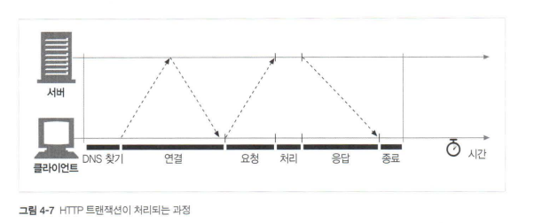
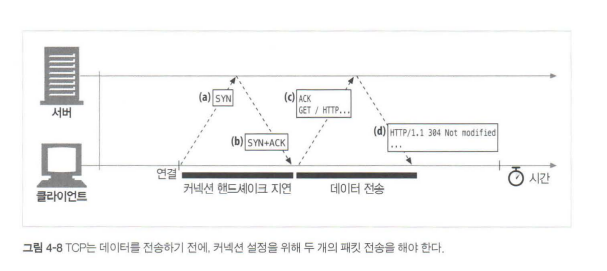
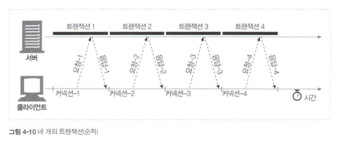
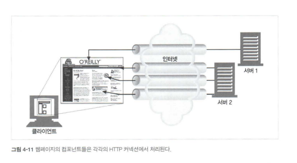
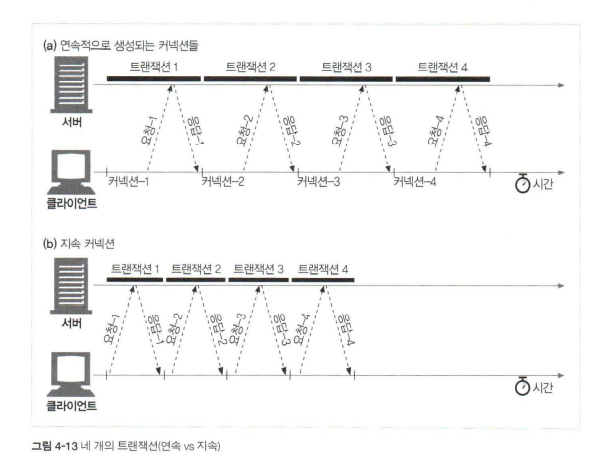
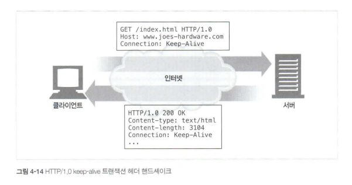

## 4.2 TCP 성능에 대한 고려

- HTTP는 TCP 바로 위에 있는 계층이기 때문에 HTTP 트랜잭션 성능은 TCP 성능의 영향을 받는다.
- TCP 프로토콜의 내부를 자세히 알아야 더 좋은 성능의 HTTP 애플리케이션을 설계하고 구현할 수 있다.

### 4.2.1 HTTP 트랜잭션 지연

- HTTP 요청 과정에서 발생하는 지연에 대해 알아보자.

- 트랜잭션을 처리하는 시간은 TCP 설정, 요청, 응답에 비하면 매우 적은 시간이 소요됨.
- 대부분의 HTTP 지연은 TCP 네트워크 지연 때문에 발생한다.

HTTP 트랜잭션을 지연시키는 원인

1. 클라이언트는 **URI에서 웹 서버의 IP 주소와 포트번호를 알아야 함.** DNS 이름 분석 인프라를 사용하여 URI에 있는 호스트 명을 IP 주소로 변환하는 데 시간이 소요된다.(수십초(과거) => ms(현재))

2. 클라이언트는 TCP 커넥션 요청을 서버에게 보내고 **서버가 커넥션 허가 응답을 회신하기 기다린다.** 수 백개의 HTTP 트랜잭션이 만들어지면  소요 시간 증가.

3. 커넥션이 맺어지면 클라이언트는 HTTP 요청을 새로 생성된 TCP 파이프를 통해 전송. **웹 서버는 TCP 커넥션에서 요청 메시지를 읽고 처리**한다. 

4. **웹 서버가 HTTP 응답을 보내는 것** 역시 시간이 소요된다.

   

### 4.2.2 성능 관련 중요 요소

### 4.2.3 TCP 커넥션 핸드셰이크 지연

- 새로운 TCP 커넥션을 열면 TCP 소프트웨어는 커넥션을 맺기 위한 조건을 맞추기 위해 연속으로 IP 패킷을 교환한다. 작은 크기에 데이터 전송에 커넥션이 사용된다면(오버헤드 발생?) 패킷 교환은 HTTP 성능을 크게 저하 시킨다.

  

TCP 핸드셰이크 순서

1. 클라이언트는 새로운 TCP 커넥션을 위한 TCP 패킷('SYN' 40~60바이트)을 서버에 보낸다.
2. 서버가 그 커넥션을 받으면 커넥션 요청이 받아들여졌음을 의미하는 'SYN', 'ACK' 플래그를 포함한 TCP 패킷을 클라이언트에 보낸다.
3. 마지막으로 클라이언트는 커넥션이 잘 맺어졌음을 알리기 위해 서버에게 다시 확인응답 신호를 보낸다. 오늘날의 TCP는 확인응답 패킷과 함께 데이터를 전송한다.

- HTTP 프로그래머는 이 패킷들을 확인하지 못함 => TCP 소프트웨어가 관리한다.
- 크기가 작은 HTTP 트랜잭션은 TCP 구성(SYN/SYN+ACK 핸드셰이크)에 50% 이상의 시간을 쓴다.

### 4.2.4 확인 응답 지연

- TCP는 성공적인 데이터 전송을 보장하기 위해 자체적인 확인 체계를 가진다.
- 각 TCP 세그먼트는 순번과 데이터 무결성 체크섬을 가진다. 만약 송신자가 특정 시간 안에 확인응답 메시지를 받지 못하면 패킷이 파기되었거나 오류가 있는 것으로 확인하고 데이터를 다시 전송한다.
- 확인응답은 크기가 작아, 데이터 패킷에 묶어 보냄으로써 네트워크를 효율적으로 사용한다.
- 확인응답 지연은 송출할 확인응답을 특정 시간 동안 버퍼에 저장해두고 확인응답을 편승시키기 위한 송출 데이터 패킷을 찾는다. 
- 안타깝게 요청과 응답 두 가지 형식으로만 이루어지는 HTTP 방식은 확인응답을 데이터 패킷에 편승시킬 기회가 적다. 
- 그렇기 때문에, 이 기능을 TCP에서 비활성화시키면 성능이 향상될 수 있다.

### 4.2.5 TCP 느린 시작(slow start)

- TCP 커넥션은 처음에는 커넥션의 최대 속도를 제한하고 데이터의 성공적인 전송을 보장한다. 성공적으로 전송되는 데이터의 양이 늘어날수록, 커넥션의 속도를 높여나간다.
- TCP 느린 시작은 TCP가 한 번에 전송할 수 있는 패킷의 수를 제한한다. 확인응답을 받을 때마다 패킷의 숫자가 늘어나 점점 속도가 증가하는 방식으로 구현되어 있다.

### 4.2.6 네이글(Nagle) 알고리즘과 TCP_NODELAY

- 어떤 크기의 데이터든지(1바이트라도) TCP 스택으로 전송할 수 있도록 TCP는 데이터 스트림 인터페이스를 제공한다. 
- 하지만 각 TCP 세그먼트는 40바이트 상당의 플래그와 헤더를 포함하여 전송하기 때문에, TCP가 작은 크기의 데이터를 포함한 많은 수의 패킷을 전송한다면 네트워크 성능은 떨어진다.
- 네이글 알고리즘은 이러한 문제를 해결하기 위해 패킷을 전송하기 전에 많은 양의 TCP 데이터를 한 개의 덩어리로 합친다.
- 또한, 세그먼트가 최대 크기가 되지 않으면 전송을 하지 않는다. 다만 다른 모든 패킷이 확인응답을 받았을 경우에는 최대 크기보다 작은 패킷의 전송을 허락한다.
- 이러한 네이글 알고리즘은 HTTP 성능과 관련해 문제가 발생한다. 크기가 작은 HTTP 메시지는 패킷을 채우지 못하기 때문에 추가적인 데이터를 기다리며 지연된다.
- 두 번째로, 확인응답 지연과 함께 쓰일 경우 성능이 저하된다. 

## 4.3 HTTP 커넥션 관리

### 4.3.1 흔히 잘못 이해하는 Connection 헤더

- HTTP Connection 헤더 필드는 커넥션 토큰을 쉼표로 구분하여 가지고 있으며, 그 값은 다른 커넥션에 전달되지 않는다.
- Connection 헤더에는 다음 세 가지 종류의 토큰이 전달된다.
  - HTTP 헤더 필드 명 : 이 커넥션에만 해당되는 헤더들의 나열
  - 임시적인 토큰 값 : 커넥션에 대한 비표준 옵션
  - close 값 : 커넥션이 작업이 완료되면 종료되어야 함을 의미
- 커넥션 토큰이 HTTP 헤더 필드 명을 가지고 있으면 해당 필드는 현재 커넥션을 위한 정보이므로 다음 커넥션에 전달되어서는 안된다.

### 4.3.2 순차적인 트랜잭션 처리에 의한 지연

- 커넥션 관리가 제대로 이루어지지 않으면 TCP 성능이 매우 안좋아질 수 있다.

- 위의 그림과 같이 4개의 트랜잭션이 이루어지면서 트랜잭션마다 커넥션이 이루어지면 느린 시작 지연이 발생할 것이다. 
- 또한, 유저는 이미지가 각각 로드되는 현상을 볼 수 있기 때문에 심리적인 지연도 발생한다.

### 4.4 병렬 커넥션

- 순차적으로 내려받는 방식은 느리기 때문에 그림처럼 한번에 여러 개의 커넥션을 발생 시켜 HTTP 트랜잭션을 병렬로 처리한다.

### 4.4.1 병렬 커넥션은 페이지를 더 빠르게 내려받는다

- 각 커넥션의 지연 시간을 겹치게 하면 총 지연 시간을 줄일  수 있고, 클라이언트의 인터넷 대역폭을 한 개의 커넥션이 다 써버리는 것이 아니라면 나머지 객체를 내려받는 데에 남은 대역폭을사용할 수 있다.

### 4.4.2 병렬 커넥션이 항상 빠르지는 않다

- 클라이언트의  네트워크 대역폭이 좁을 때 (예를 들어브라우저가 28.8Kbps 모뎀으로 인터넷에 연결되어 있는 경우)는 대부분 시간을 데이터를 전송하는 데만 쓸 것이다. 여러 개의  객체를 병렬로 내려받는 경우, 이 **제한된 대역폭 내에서 각 객체를 전송받는 것은 느리기 때문에** 성능상의 장점은 거의 없어진다. 

- 또한 다수의 커넥션은 메모리를 많이 소모하고 자체적인 성능 문제를 발생시킨다.  복잡한 웹페이지는 수십 개에서 수 백 개의 객체를 포함한다.
- 브라우저는 실제로 병렬 커넥션을 사용하긴 하지만 적은 수(대부분은 4개)의 병렬 커넥션만을 허용한다. 서버는 특정 클라이언트로부터 과도한 수의 커넥션이 맺어졌을 경우, 그것을 임의로 끊어버릴 수 있다. 

### 4.4.3 병렬 커넥션은 더 빠르게 '느껴질 수' 있다

- 화면에 여러 개의 객체가 동시에 보이면서 내려받고 있는 상황을 볼 수 있기 때문에 사용자는 더 빠르게 내려받고 있는 것처럼 느낄 수 있다. 사실 사람들은 페이지의 총 다운로드 시간이 더 걸린다 하더라도, 화면 전체에서 여러 작업이 일어나는 것을 눈으로 확인할 수 있으면 그것을 더 빠르다고 여긴다.

## 4.5 지속 커넥션

- HTTP/1.1을 지원하는 기기는 처리가 완료된 후에도 TCP 커넥션을 유지하여 앞으로 있을 HTTP 요청에 재사용할 수 있다. 처리가 완료된 후에도 계속 연결된 상태로 있는 TCP 커넥션을 지속 커넥션이라고 부른다.

### 4.5.1 지속 커넥션 vs 병렬 커넥션

병렬 커넥션은 다음과 같은 단점이 있었다.

- 각 트랜잭션마다 새로운 커넥션을 맺고 끊기 때문에 시간과 대역폭이 소요된다.  
- 각각의 새로운 커넥션은 TCP 느린 시작 때문에 성능이 떨어진다.  
- 실제로 연결할 수 있는 병렬 커넥션의 수에는 제한이 있다.

지속 커넥션은 병렬 커넥션에 비해 몇 가지 장점이 있다.

- 커넥션을 맺기 위한 사전 작업과 지연을 줄여줌.
- 튜닝된 커넥션을 유지
- 커넥션 수를 줄여줌.

- 하지만 지속 커넥션을 잘못 관리할 경우, 계속 연결된 상태로 있는 수많은 커넥션이 쌓이게 될 이다. 이는 로컬의 리소스 그리고 원격의 클라이언트와 서버의 리소스 에 불필요한 소모를 발생시킨다.
- 지속 커넥션은 병렬 커넥션과 함께 사용될 때에 가장 효과적이다.

### 4.5.2 HTTP/1.0+의 Keep-Alive 커넥션

- HTTP/1.0부터 지속 커넥션을 위한 실험적인 Keep-Alive 커넥션을 실험적으로 지원하기 시작했다.
- HTTP/1.1부터 Keep-Alive 커넥션의 에러가 수정되었다고 한다. 

- 같은 네 개의 HTTP 트랜잭션에 대해서, 연속적으로 네 개의 커넥션을 생성하여 처리하는 방식과 하나의 지속 커넥션으로만 처리하는 방식을 비교하였다. 커넥션을 맺고 끊는데 필요한 작업이 없어서 시간이 단축되었다.

### 4.5.3 Keep-Alive 동작

- keep-alive는 사용하지 않기로 결정되어 HTTP/1.1 명세에서 빠졌다. 하지만 아직도 브라우저와 서버 간에 keep- alive 핸드셰이크가 널리 사용되고 있기 때문에, HTTP 애플리케이션은 그것을 처리할 수 있게 개발해야 한다. 이제 keep-alive가  동작하는 방식을 간단히 살펴보자.

- HTTP/1.0 keep-alive 커넥션을 구현한 클라이언트는 커넥션을 유지하기 위해서  요청 Connection:Keep-Alive 헤더를 포함시킨다. 이 요청을 받은 서버는 그다음 요청도 이 커넥션을 통해 받고자 한다면, 응답 메시지에 같은 헤더를 포함시켜 응답한다. 응답에 Connection: Keep-Alive 헤더가 없으면, 클라이언트는 서버가 keep-alive를 지원하지 않으며, 응답 메시지가 전송되고 나면 서버 커넥션을 끊을 것이라 추정한다.

