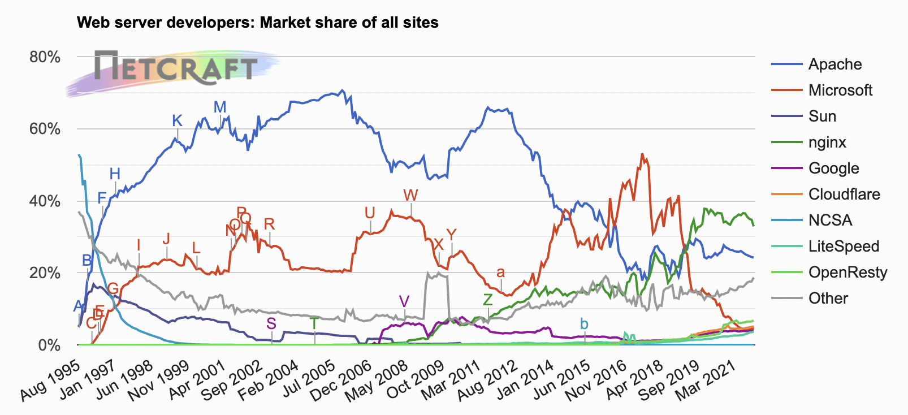
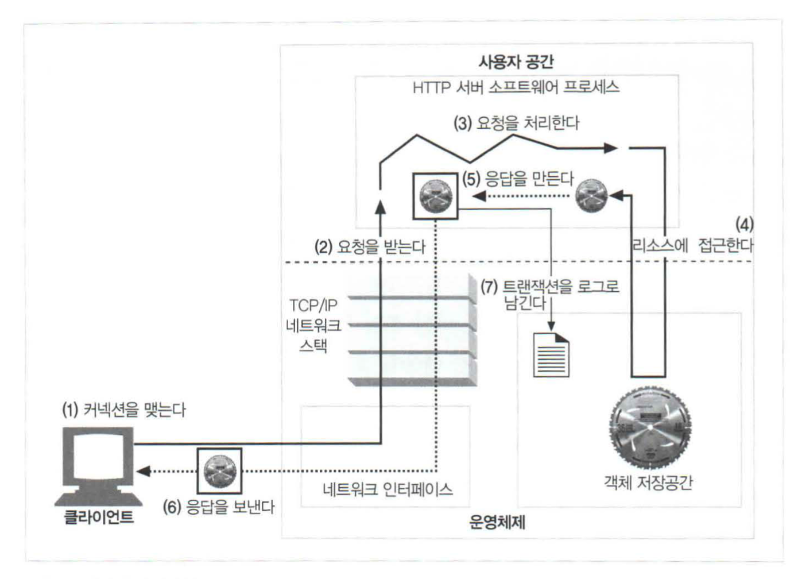
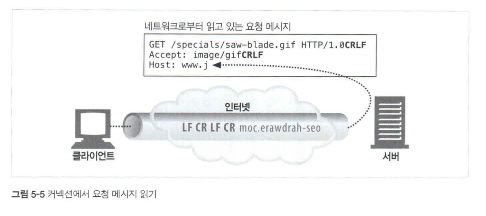
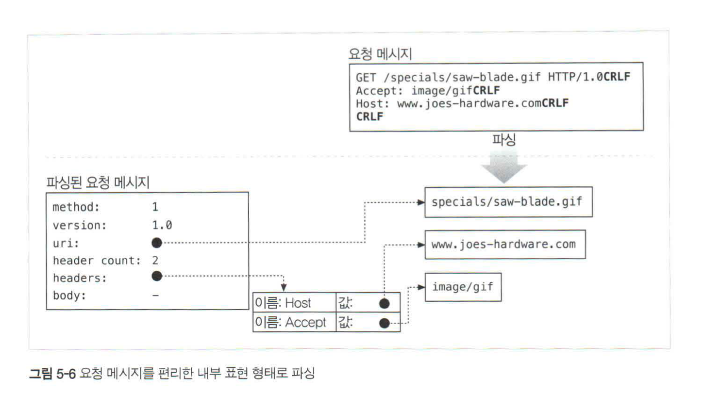
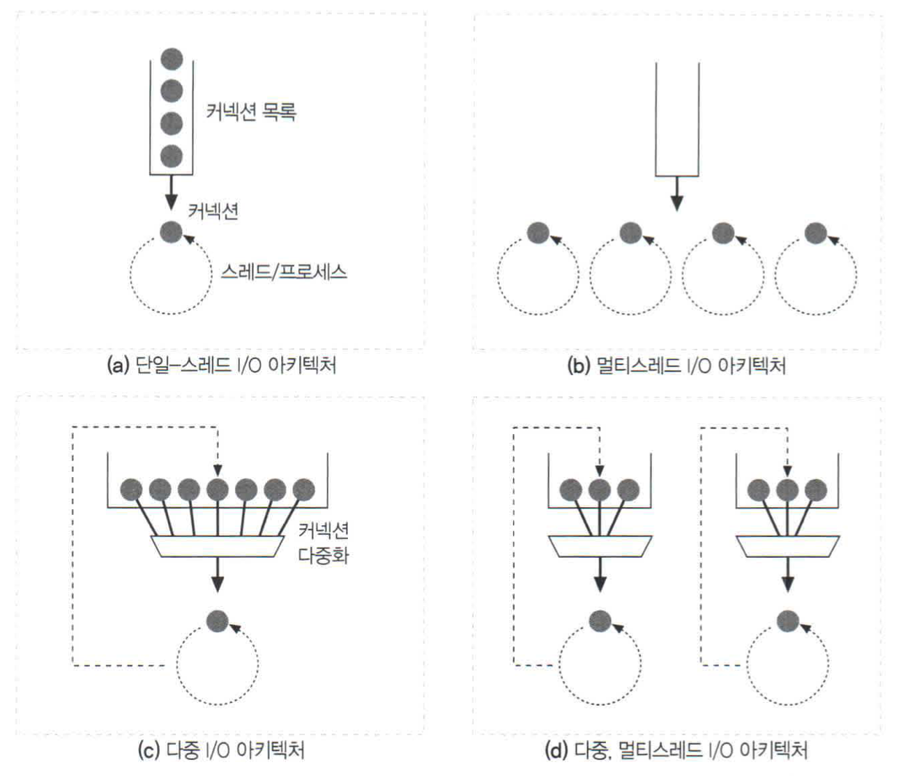
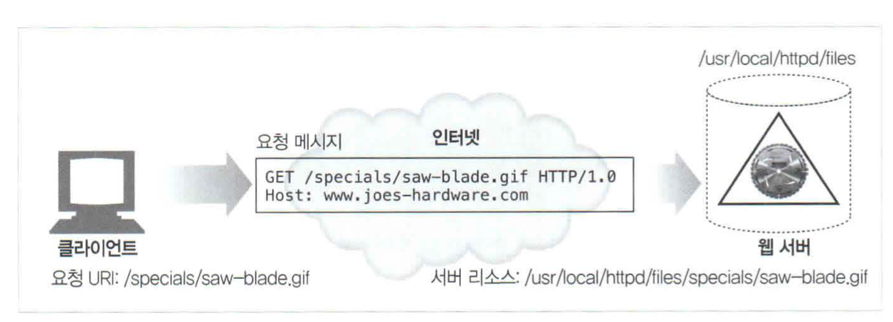
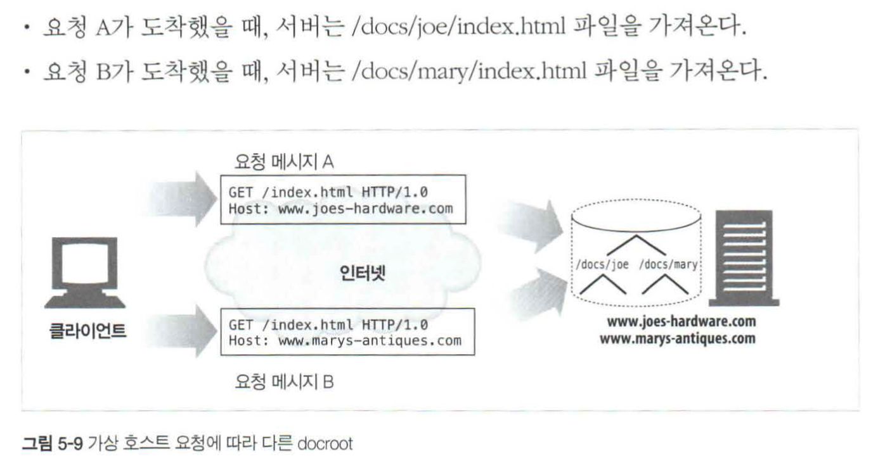
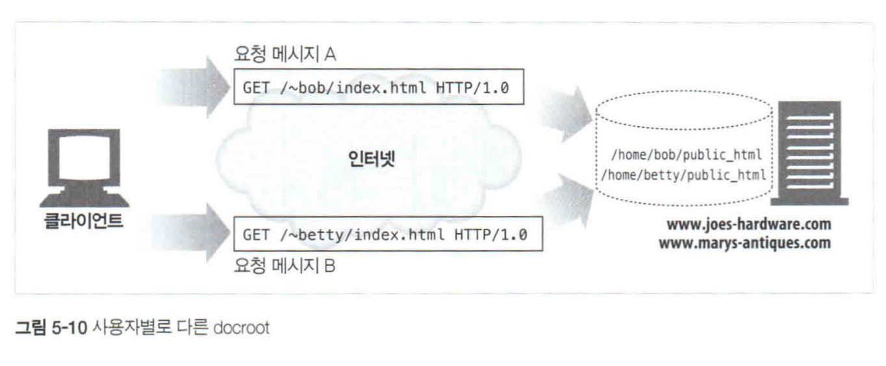
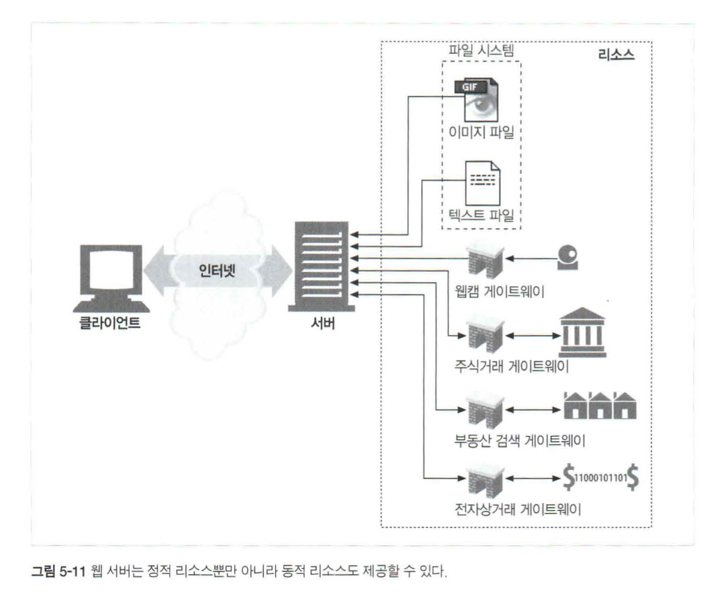
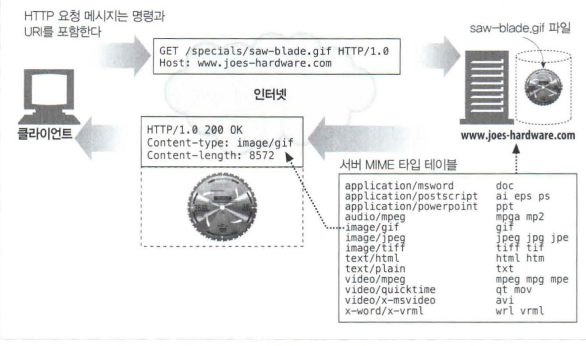

# 5장 웹 서버

## 5.1 다채로운 웹 서버

- 웹 서버는 HTTP 요청을 처리하고 응답을 제공함

- 웹 서버는 웹페이지 제공에 특화된 하드웨어 장비 또는 소프트웨어를 모두 가리킬 수 있음

### 5.1.1 웹 서버 구현

 웹 서버 기능

- HTTP 프로토콜을 구현

- 웹 리소스 관리

- 웹 서버 관리 기능 (설정, 통제, 확장)

- TCP 커넥션 관리에 대한 책임을 운영체제와 나눠 갖음

  > 운영체제는 컴퓨터 시스템의 하드웨어를 관리하고 TCP/IP 네트워크 지원, 웹 리소스를 유지하기 위한 파일 시스템, 현재 연산 활동을 제어하기 위한 프로세스 관리를 제공

웹 서버 형태

- 다목적 소프트웨어 웹 서버를 표준 컴퓨터 시스템에 설치하고 실행
- 웹 서버를 내장시켜 완전한 관리 콘솔로 제공

### 5.1.2 다목적 소프트웨어 웹 서버

- 다목적 소프트웨어 웹 서버는 네트워크에 연결된 표준 컴퓨터 시스템에서 동작

  - 아파치, W3C 직소 같은 오픈소스
  - 마이크로소프트, 아이플래닛의 웹 서버 같은 상용 소프트웨어

- 인기 있는 웹 서버 소프트웨어

  

### 5.1.3 임베디드 웹 서버

임베디드 웹 서버는 일반 소비자용 제품에 내장될 목적으로 만들어진 작은 웹 서버

## 5.3 진짜 웹서버가 하는 일

## 5.4 단계 1 : 클라이언트 커넥션 수락

클라이언트가 이미 서버와 연결된 지속적인 커넥션을 갖고 있다면, 요청을 보내기 위해 연결되어 있는 커넥션을 사용할 수 있음

연결된 커넥션이 없다면, 새 커넥션을 열어야 함

### 5.4.1 새 커넥션 다루기

1. 클라이언트가 웹 서버에 TCP 커넥션을 요청

2. 웹 서버는 커넥션을 맺고 TCP 커넥션에 IP 주소를 추출하여 커넥션 맞은편의 클라이언트를 확인
3. 새 커넥션이 맺어지면, 서버는 새 커넥션을 커넥션 목록에 추가하고 오가는 데이터를 지켜보기 위한 준비를 함

4. 웹 서버는 커넥션을 거절하거나 즉시 닫을 수 있음 (비인가 클라이언트의 경우 커넥션을 닫을 수 있다)

### 5.4.2 클라이언트 호스트 명 식별

대부분 웹 서버는 "역방향 DNS" 를 사용해서 클라이언트의 IP 주소를 클라이언트의 호스트 명으로 변환하도록 설정되어 있음

웹 서버는 클라이언트 호스트 명을 구체적인 접근 제어와 로깅을 위해 사용할 수 있음

호스트명 룩 업은 꽤 시간이 많이 걸릴 수 있기 때문에, 웹 트랜잭션에 영향을 미칠 수 있고, 따라서 대용량 웹 서버는 호스트 명 분석(hostname resolution)을 꺼두거나 특정 컨텐츠에 대해서만 켜놓는다.

## 5.5 단계 2 : 요청 메세지 수신

커넥션에 데이터가 도착하면, 웹 서버는 메세지를 파싱하여 요청 메세지를 구성함

- 요청 줄을 파싱 (메소드, URI, HTTP 버전) - 스페이스로 구분, 캐리지 리턴 줄바꿈으로 끝남
- 메세지 헤더를 읽음 - 각 메세지 헤더는 캐리지 리턴 줄바꿈으로 구분
- 존재한다면 헤더의 끝을 의미하는 캐리지 리턴 줄바꿈을 찾음
- 요청 본문이 있다면, 읽어 들인다. 길이는 헤더의 Content-Length 로 정의

### 5.5.1 메세지의 내부 표현

몇몇 웹 서버는 요청 메세지를 쉽게 다룰 수 있도록 내부 자료 구조에 저장함

- 헤더는 속도가 빠른 룩업 테이블에 저장

### 5.5.2 커넥션 입력/출력 처리 아키텍쳐

고성능의 웹 서버는 수천 개의 커넥션을 동시에 열 수 있도록 지원함

**단일 스레드 웹 서버**

- 한 번에 하나의 요청을 처리
- 하나의 트랜잭션이 완료되면, 다음 커넥션이 처리
- 구현이 간단하지만, 처리 도중에 모든 다른 커넥션은 무시
- 성능 문제가 발생할 수 있기 때문에 로드가 적은 서버에 적절하다.

**멀티프로세스와 멀티스레드 웹 서버**

- 여러 요청을 동시에 처리하기 위해 여러개의 프로세스 은 고효율 스레드를 할당
- 스레드/프로세스는 필요할 때마다 만들거나, 미리 만들어 둠
- 몇몇 서버는 매 커넥션마다 스레드/프로세스를 하나씩 할당하지만, 수백~수만 개의 동시 커넥션을 처리하게 되면 리소스(메모리/CPU)에 부하가 많이 걸리기 떄문에 스레드/프로세스의 최대 개수에 제한을 건다.

**다중 I/O 서버**

- 대량의 커넥션을 지원하기 위해, 많은 웹 서버는 다중 아키텍처를 채택함
- 모든 커넥션은 동시에 활동을 감시 당함
- 커넥션의 상태가 바뀌면(데이터를 사용할 수 있게되거나 에러가 발생), 그 커넥션에 대한 작은 양의 처리가 수행되고, 처리가 완료되면 다음 상태 변경을 위해 커넥션은 커넥션 목록으로 돌아감
- 커넥션에 대해 작업을 수행하는 것은 해당 커넥션에 실제 해야 할 일이 있을 때 뿐이다.
- 스레드와 프로세스는 유휴 상태의 커넥션에 매여 기다리는 리소스 낭비를 줄일 수 있다.

**다중 멀티스레드 웹 서버**

- 몇몇 시스템은 CPU 여러개의 이점을 살리기 위해 멀티스레딩과 다중화(멀티플렉싱)를 결합함
- 여러 개의 스레드(하나의 물리적 프로세스)는 각각 열려있는 커넥션(혹은 열려있는 커넥션의 부분 집합)을 감시하고 각 커넥션에 대해 조금씩 작업을 수행함

## 5.6 단계 3 : 요청 처리

웹 서버가 요청을 받으면, 서버는 요청으로부터 메서드, 리소스, 헤더, 본문을 얻어내어 치라함

## 5.7 단계 4 : 리소스의 매핑과 접근

웹 서버는 리소스 서버이다.

정적 리소스 : HTML 페이지나 이미지 등의 미리 만들어진 컨텐츠를 제공함

동적 리소스 : 서버 위에서 동작하는 리소스 생성 애플리케이션을 통해 만들어진 동적 콘텐츠도 제공

### 5.7.1 Docroot

웹 서버는 여러 종류의 리소스 매핑을 지원함

가장 단순한 리소스 매핑은, URI를 웹 서버의 파일 경로로 사용하는 것

이때, 문서 루트(docroot)를 지정하여 기본 경로로 사용할 수 있음

docroot 하위에 있는 리소스만 허용해야 보안문제가 없음

성숙한 웹 서버는 상대 URL을 이용하여 접근하지 못하도록 차단함

**가상 호스팅된 docroot**

가상 호스팅 웹 서버는 각 사이트에 그들만의 분리된 문서 루트를 주는 방법으로, 한 웹 서버에서 여러개의 웹 사이트를 호스팅 함

URI나 Host 헤더에서 얻은 IP 주소나 호스트 명을 이용해 올바른 문서 루트를 식별함

이 방법으로 하나의 웹 서버에서 두 개 이상의 사이트가 완전히 분리된 콘텐츠를 갖고 호스팅 되도록 할 수 있음

**가상 홈 디렉토리 docroots**

docroot의 또 다른 대표적인 활용은, 사용자들이 한 대의 웹 서버에서 각자의 개인 웹 사이트를 만들 수 있도록 해주는 것

보통 `/` 또는 `~` 다음에 사용자 이름이 오는 것으로 시작하는 URI는 그 사용자의 개인 문서 루트를 가리킴

### 5.7.2 디렉토리 목록

웹 서버는 경로가 파일이 아닌 디렉토리를 가리키는 디렉토리 URL에 대한 요청을 받을 수 있음

웹 서버는 디렉토리 URL 요청에 대해 다음과 같이 처리할 수 있음

- 에러 반환
- 디렉터리 대신 특별한 색인 파일을 반환
- 디렉터리를 탐색해 그 내용을 담은 HTML 페이지를 반환

대부분의 웹 서버는 요청한 URL에 대응되는 디렉터리 안에서 index.html 파일을 찾아 반환함

아파치에서는 디폴트로 반환할 기본 색인 파일을 DirectoryIndex 지시자를 통해 설정할 수 있음

만약, 기본 색인 파일이 없고, 디렉터리 색인 기능이 꺼져있지 않다면 대부분의 웹 서버는 디렉토리의 파일들의 파일명 크기 등을 열거하여 html을 반환 (하지만 노출을 원치 않는 파일까지 노출이 되는 단점이 존재하여 기능을 끄는 것이 좋다.)

### 5.7.3 동적 콘텐츠 리소스 매핑

동적 콘텐츠를 생성하는 프로그램에 URI를 매핑

웹 서버 중에서 애플리케이션 서버라고 불리는 것들은 웹 서버를 복잡한 백엔드 애플리케이션고 연결하는일을 함

리소스가 동적 리소스라면 애플리케이션 서버는 그에 대한 동적 콘텐츠 생성 프로그램이 어디에 있는지, 그리고 어떻게 그 프로그램을 실행하는지 알려줄 수 있어야 함

아파치는 URI의 경로명이 실행 가능한 프로그램이 위치한 디렉터리로 매핑되도록 설정하는 기능을 제공함

서버가 실행 가능한 경로명을 포함한 URI로 요청을 받으면, 그 경로에 대응하는디렉터리에서 프로그램을 찾아 실행

- URI 경로가 /cgi-bil1/으로 시작한다면 /usr/loca1/etc/bttpd/cgi-programs/에서 프로그램을 찾아 실행하라는 의미

- `ScriptAlias /cgi-bin/ /usr/local/etc/httpd/cgi-programs/`

또한 아파치에서는 특정 확장자의 파일만 실행하도록 설정할 수도 있다. 이 방법은 실행 가능한 스크립트를 아무 디렉터리에나 위치시킬 수 있음

다음의 아파치 설정 지시자는 .cgi로 끝나는 모든 웹 리소스는 실행되어야 함을 명시한다.

- `AddHandler cgi-script .cgi`

웹 초창기에 널리 쓰였던 CGI는 서버사이드 애플리케이션을 실행하기 위한 간단한 인터페이스다.

오늘날의 애플리케이션 서버는, 마이크로소프트의 액티브 서버 페이지와 자바 서블릿과 같은 한층 더 강력하고 효과적인 서버사이드 동적 콘텐츠 지원기능을 갖고있다.

### 5.7.4 서버사이드 인클루드

많은 웹 서버가 서버사이드 인클루드도 지원함

어떤 리소스가 서버사이드 인클루드를 포함하고 있는 것으로 설정되어 잇다면, 서버는 그 리소스의 컨텐츠를 클라이언트에게 보내기 전에 처리함

서버는 컨텐츠에 변수 이름이나 내장된 스크립트가 될 수 있는 어떤 특별한 패턴이 있는지 검사를 받고, 특별한 패턴은 변수 값이나 실행가능한 스크립트의 출력 값으로 치환됨 (동적 콘텐츠를 만드는 쉬운 방법)

### 5.7.5 접근 제어

웹 서버는 각각의 리소스에 접근 제어를 할당할 수 있다.

접근 제어 되는 리소스에 대한 요청이 도착했을 때 웹 서버는 클라이언트의 IP 주소에 근거하여 접근을 제어할 수 있고 혹은 리소스에 접근하기 위한 비밀번호를 물어볼 수도 있음

## 5.8 단계 5 : 응답 만들기

서버가 리소스를 식별하면, 서버는 요청 메소드로 서술되는 동작을 수행한 뒤 응답 메세지를 반환함

응답 메세지는 응답상태코드, 응답헤더, 응답본문을 포함

### 5.8.1 응답 엔티티

만약 트랜잭션이 웅답 본문을 생성한다면, 그 내용을 응답 메시지와 함께 돌려보냄

만약 본문이 있다면, 응답 메시지는 주로 다음을 포함

- 응답 본문의 MlME 타입을 서술하는 Content-Type 헤더
- 응답 본문의 길이를 서술하는 Content-Length 헤더
- 실제 응답 본문의 내용

### 5.8.2 MIME 타입 결정하기

MIME 타입과 리소스를 연결하는 여러가지 방법

**mime.types**

- 웹 서버는 MIME 타입을 나타내기 위해 파일 이름의 확장자를 사용할 수 있음

- 웹 서버는 각 리소스의 MlME 타입을 계산하기 위해 확장자별 MIME 타입이 담겨 있는 파일을 탐색 

- 가장 흔한 방법

**매직 타이핑 (Magic typing)**
아파치 웹 서버는 각 파일의 MlME 타입을 알아내기 위해 파일의 내용을 검사해서 알려진 패턴에 대한 테이블(매직 파일이라 불린다)에 해당하는 패턴이 있는지 찾아 볼수 있음

이 방법이 느리긴하지만파일이 표준확장자없이 이름지어진 경우에는 편리함

**유형 명시(Explicittyping)**
특정 파일이나 디렉터리 안의 파일들이 파일 확장자나 내용에 상관없이 어떤 MIME 타입을 갖도록 웹 서버를 설정할 수 있음

**유형 협상(Type negotiation)**
어떤 웹 서버는 한 리소스가 여러 종류의 문서 형식에 속하도록 설정할 수 있음

이 때 웹 서버가 사용자와의 협상 과정을 통해 사용하기 가장 좋은 형식(그리고 대웅 하는 MIME 타입)을 판별할 것인지의 여부도 설정할 수 있음

또한 웹 서버는 특정 파일이 특정 MlME 타입을 갖게끔 설정할 수도 있음

### 5.8.3 리다이렉션

웹 서버는 종종 리다이렉션 응답을 반환함

Location 응답 헤더는 콘텐츠의 새로운 위치에 대한 URI를 포함

**영구히 리소스가 옮겨진 경우** : 301

**임시로 리소스가 옮겨진 경우** : 303, 307

**URL 증강** : 303, 307

**부하 균형** : 303, 307

**디렉토리 이름 정규화**

## 5.9 단계 6 : 응답 보내기

웹 서버는 받을 때와 마찬가지로 커넥션 너머로 데이터를 보낼 때도 비슷한 이슈에 직면함

서버는 여러 클라이언트에 대한 많은 커넥션을 가질 수 있음

서버는 커넥션 상태를 추적해야 하며 지속적인 커넥션은 특별히 주의해서 다룰 필요가 있음 

- 비지속적인 커넥션이  서버는 모든 메시지를 전송했을 때 자신 쪽의 커넥션을 닫음

- 지속적인 커넥션: 서버가 Content-Length 헤더를 바르게 계산하기 위해 특별한 주의를 필요로 하는 경우나, 클라이언트가 응답이 언제 끝나는지 알 수 없 는 경우에, 커넥션은 열린 상태를 유지

## 5.10 단계 7 : 로깅

트랙잭션이 완료되었을 때 웹 서버는 트랜잭션이 어떻게 수행되었는지에 대한 로그를 로그 파일에 기록함
