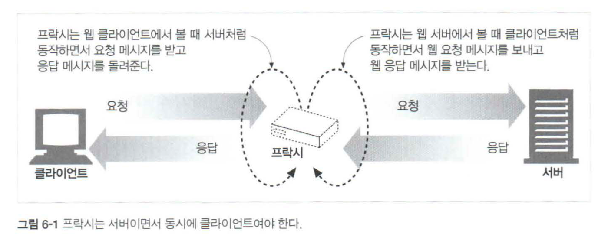
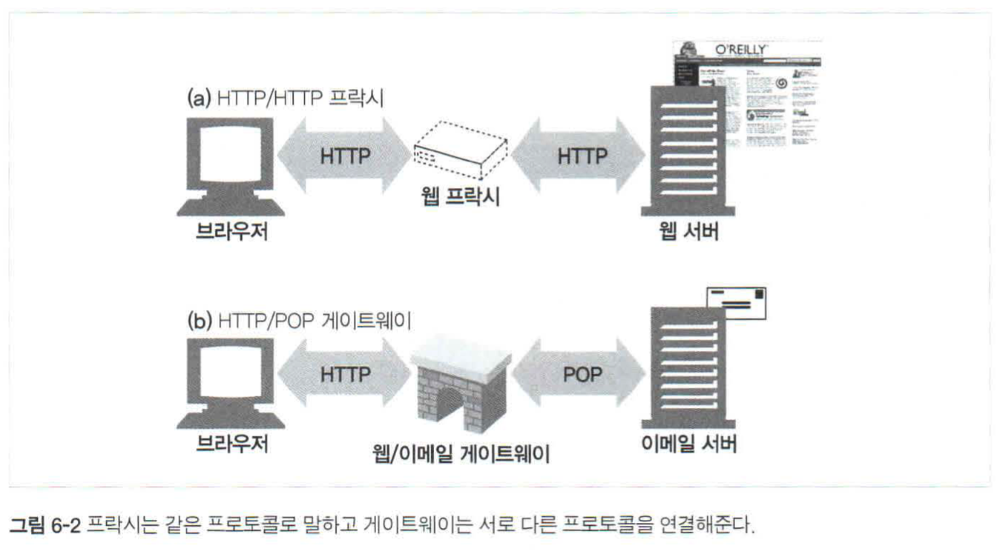
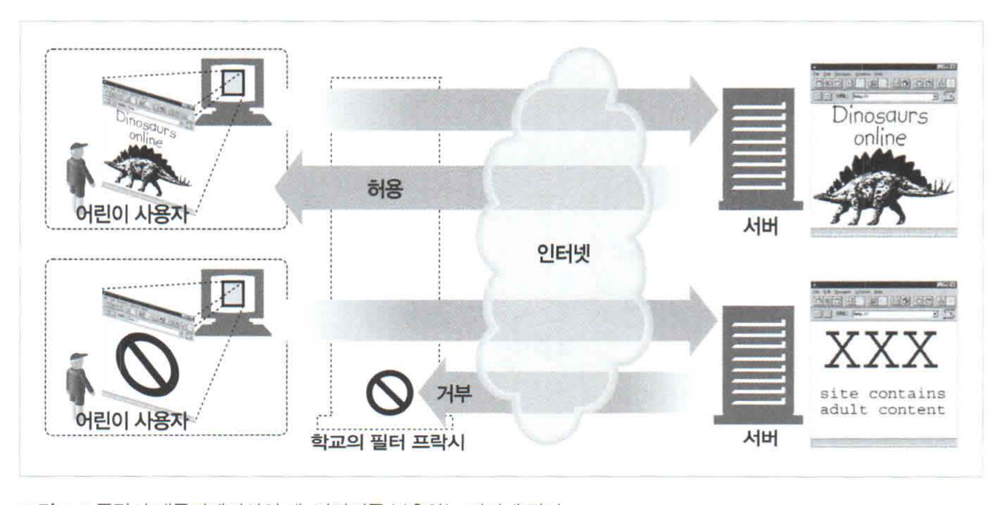
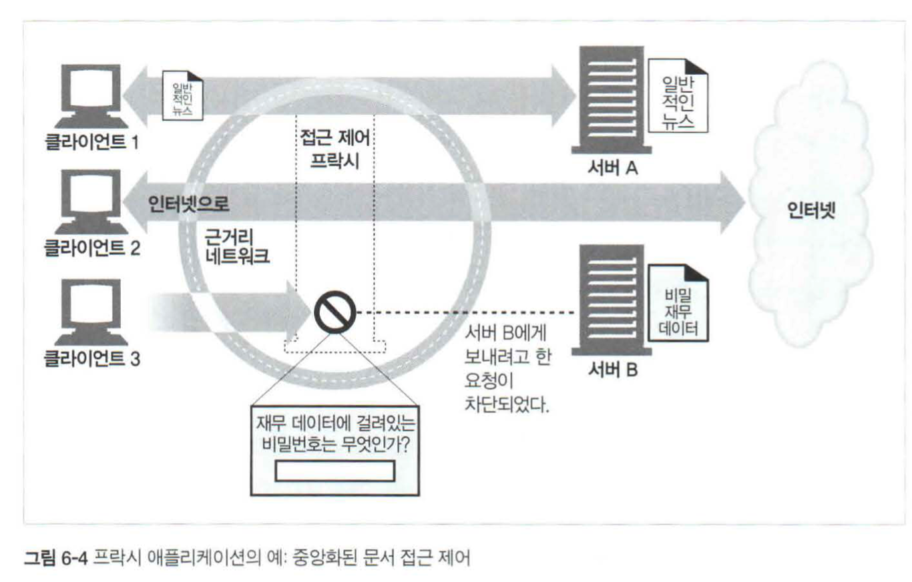
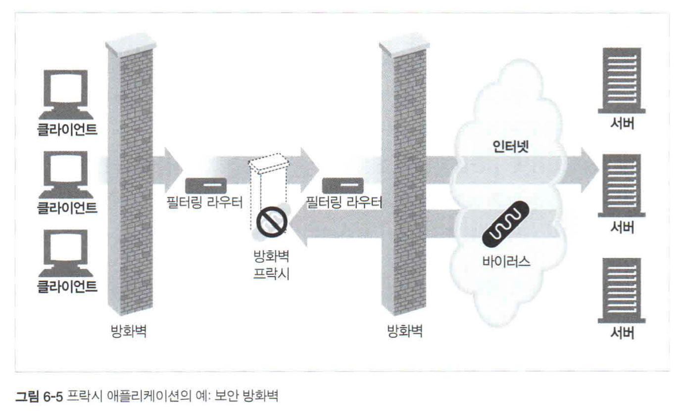
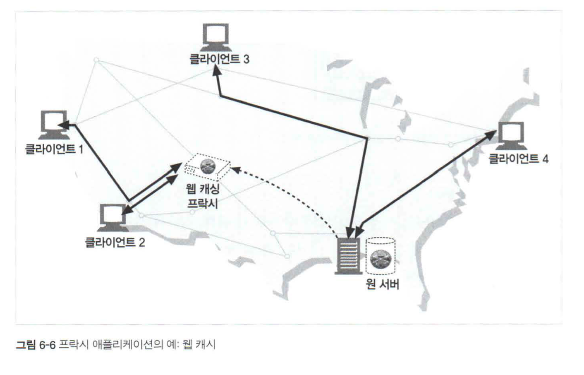
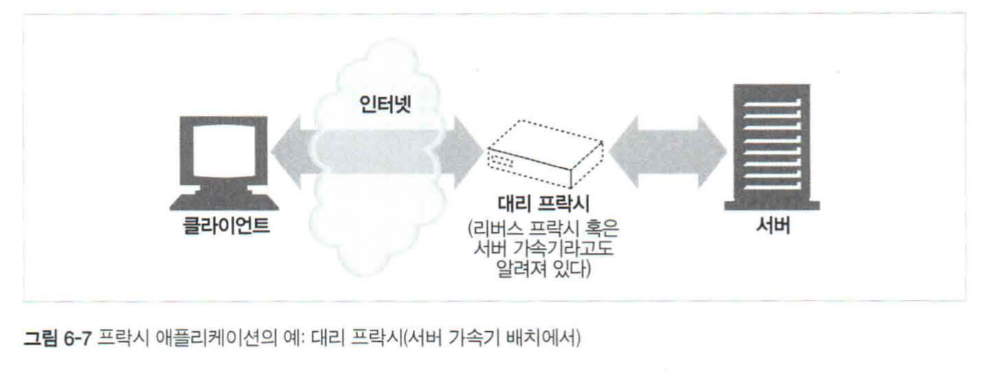
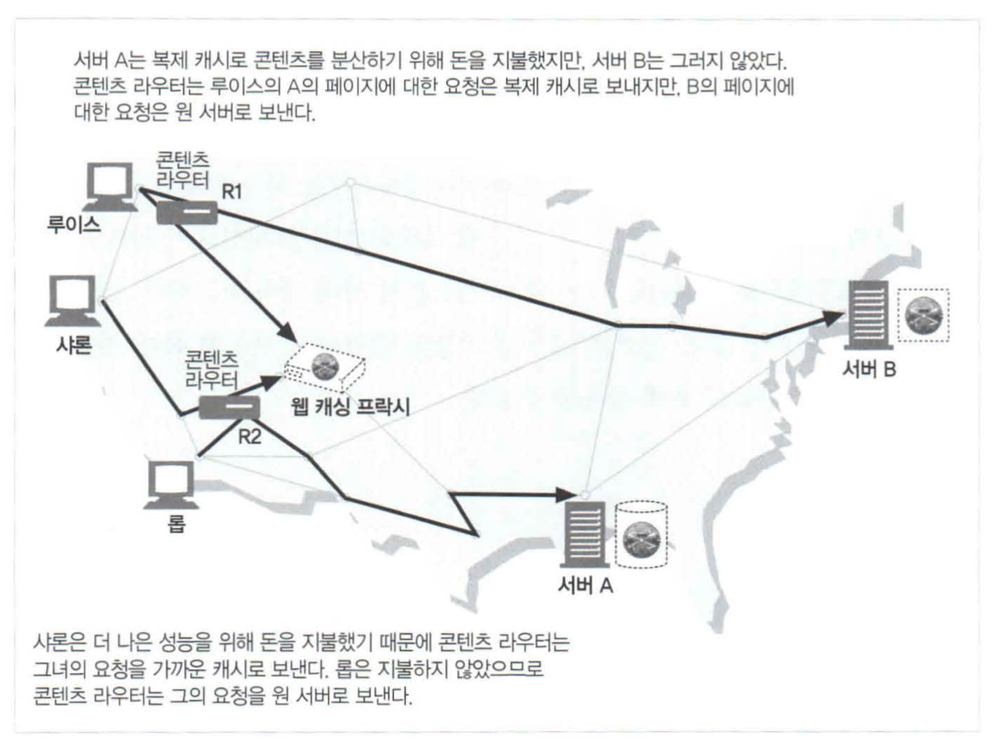
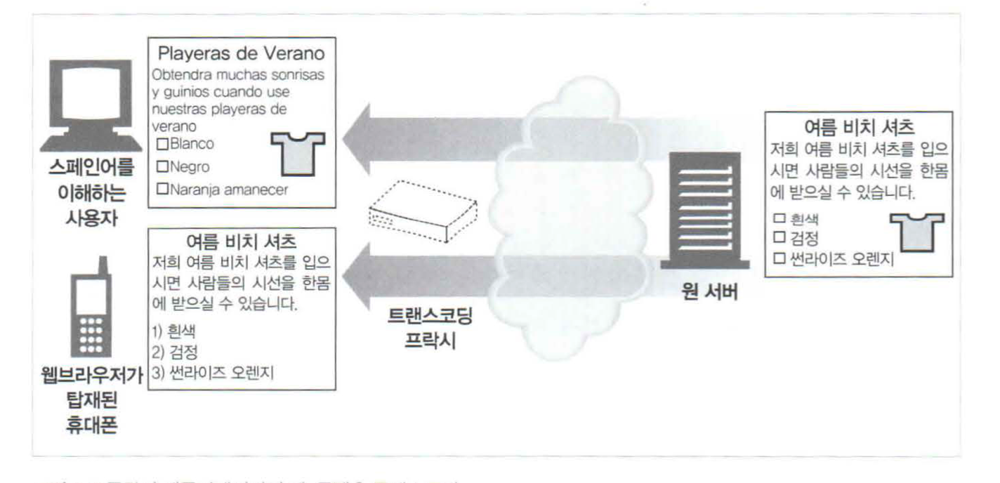
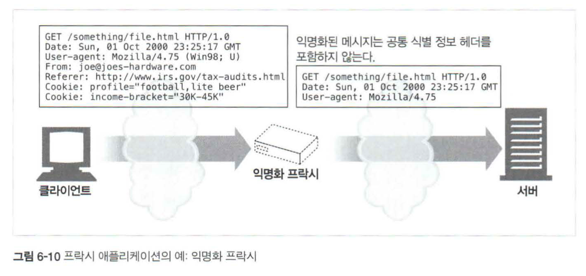

# 6장 프락시

웹 프락시 서버는 클라이언트와 서버 사이에 위치하여 HTTP 메세지를 정리하는 중개자 역할을 한다.

## 6.1 웹 중개자

클라이언트는 웹 서버와 직접 통신하는 대신에, 프락시를 통해 웹서버와 통신할 수 있음

프락시는 클라이언트 입장에서 트랜잭션을 수행하는 중개인

HTTP 프락시 서버는 웹 서버이기도 하고 웹 클라이언트이기도 함

- 프락시는 HTTP 클라이언트의 요청을 받게 되므로, 반드시 웹 서버처럼 요청과 커넥션을 적절히 다루고 응답을 돌려주어야 함

- 동시에 프락시는 요청을 서버로 보내기도하므로, 요청을 보내고 응답을 받는 올바른 HTTP 클라이언트처럼 동작해야 함

### 6.1.1 개인 프락시와 공유 프락시

프락시 서버는 하나의 클라이언트가 독점적으로 사용할 수도 있고, 여러 클라이언 트가 공유할 수도 있다.

**공유 프락시**

대부분의 프락시는 공용이며 공유된 프락시

중앙 집중형 프락시를 관리하는게 더 비용효율이 높음

캐시 프락시 서버와 같은 몇몇 프락시 애플리케이션은 프락시를 이용하는 사용자가 많을수록 유리함

**개인 프락시**

개인 전용 프락시는 주로 클라이언트 컴퓨터에서 직접 실행되는 형태

어떤 브라우저 보조 제품들은 몇몇 ISP서비스와 마찬가지로 브라우저의 기능을 확장하거나 성능을 개선하거나 무료 ISP 서비스를 위한 광고를 운영하기 위해 작은 프락시를 사용자의 컴퓨터에서 직접 실행함

### 6.1.2 프락시  vs  게이트웨이

프락시 : 같은 프로토콜을 사용하는 둘 이상의 애플리케이션을 연결

게이트웨이 : 서로 다른 프로토콜을 사용하는 둘 이상을 연결

게이트웨이는 클라이언트와 서버가 서로 다른 프로토콜로 말하더라도 서로 간의 트랜 잭션을 완료할 수 있도록 해주는 프로토콜 변환기처 럼 동작함

실질적으로 프락시와 게이트웨이의 차이점은 모호함

## 6.2 왜 프락시를 사용하는가?

- 보안을 개선
- 성능 향상
- 비용 절약

**어린이 필터**

**문서 접근 제어자**

**보안 방화벽**

네트워크보안 엔지니어는종종보안을강화하기 위해 프락시 서버를사용함

프락시 서버는 조직 안에 들어오거나 나가는 웅용 레벨 프로토콜의 흐름을 네트워크 의 한지점에서 통제

바이러스를 제거하는 웹이나 이메일 프락시가 시용할 수 있는, 트래픽을 세심히 살펴볼 수 있는 후크(hook)를 제공

**웹 캐시**

**대리 프락시**

웹 서버인것처럼 위장

리버스 프락시라 불림

**콘텐츠 라우터**

**트랜스코더**

**익명화 프락시**

